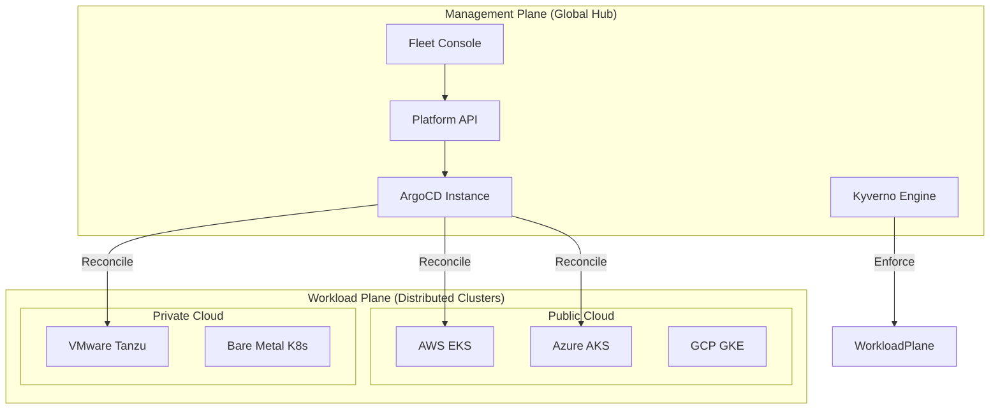
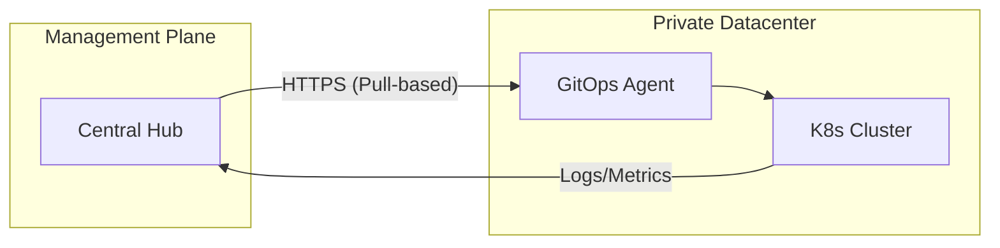
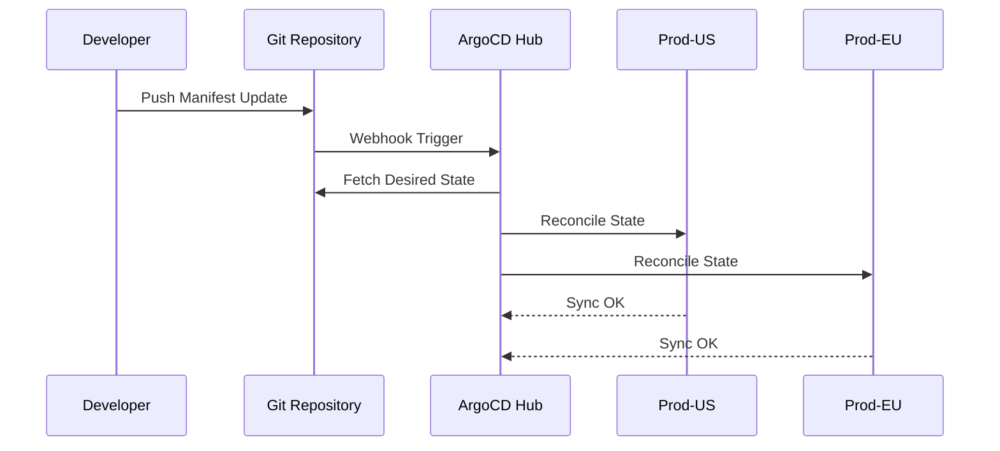
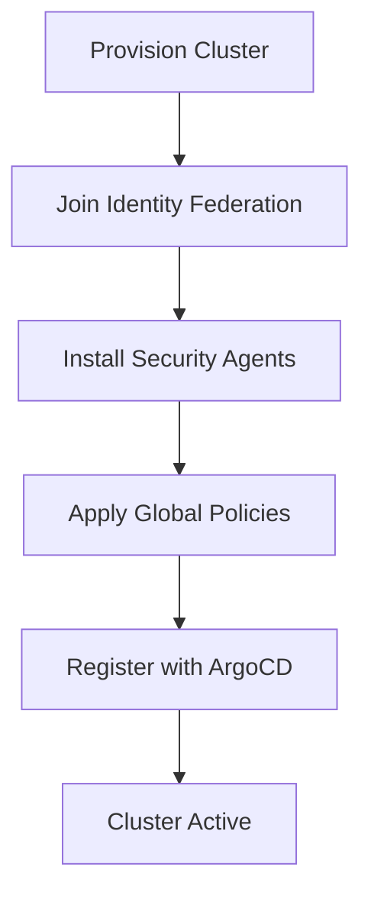
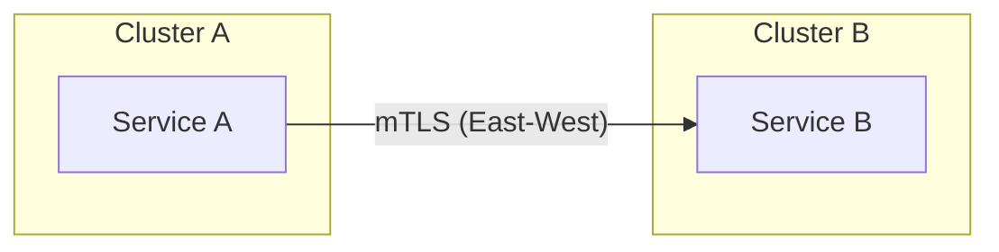
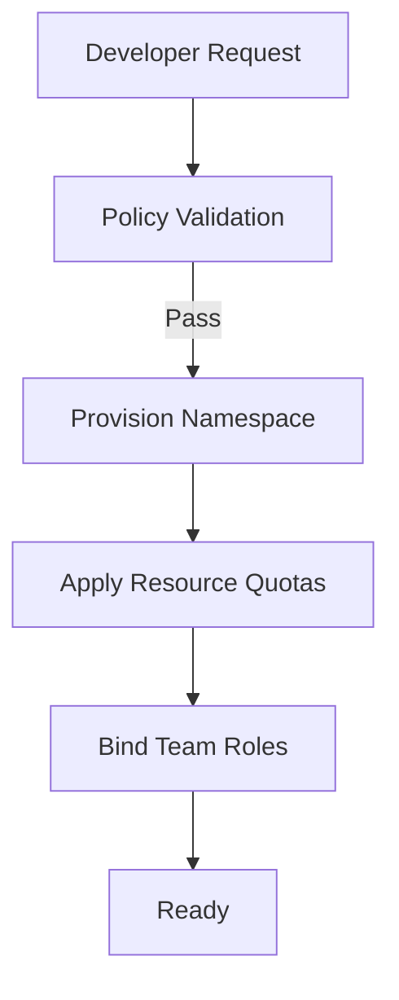
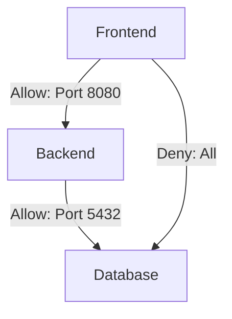
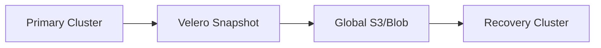
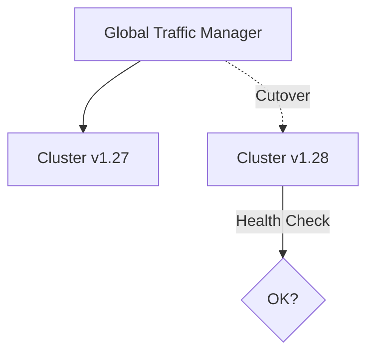
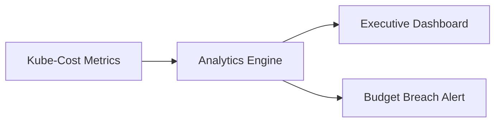

<div align="center">


<h1>Hybrid Kubernetes Platform Patterns</h1>

<p><strong>The Definitive Enterprise Reference Architecture for Multi-Cloud, Multi-Region, and Hybrid-Cloud Kubernetes Orchestration</strong></p>

[]()
[]()
[]()
[]()
[]()

<br/>

> **"Infrastructure is code; platform is a service."** 
> Hybrid Kubernetes Platform Patterns is an institutional-grade blueprint designed for organizations operating at global scale. It provides standardized, secure, and highly automated patterns for deploying and managing Kubernetes fleets across AWS, Azure, GCP, VMware, and Bare Metal.

</div>

---

## 🏛️ Executive Summary

The **Hybrid Kubernetes Platform Patterns** is a flagship repository designed for CIOs, Platform Leaders, and Principal SREs. In the era of distributed computing, Kubernetes has evolved from a container orchestrator to the universal operating system of the cloud. However, managing Kubernetes across fragmented environments—on-premises datacenters, edge sites, and multiple public clouds—presents massive operational friction.

This platform provides a **Unified Management Plane** approach. It demonstrates how to leverage **ArgoCD**, **Terraform**, **Crossplane**, and **Kyverno** to create a seamless "Golden Path" for developers, ensuring that a workload running on EKS in `us-east-1` behaves identically to one on VMware Tanzu in a private datacenter.

---

## 🚀 Business Outcomes & Drivers

### 🎯 Key Business Outcomes
- **Velocity at Scale**: Reduce cluster provisioning from weeks to minutes via standardized templates.
- **Operational Consistency**: Eliminate "snowflake" clusters through GitOps and Policy-as-Code.
- **Cost Optimization**: Gain 360-degree visibility into cluster spending with integrated FinOps governance.
- **Risk Mitigation**: Enforce zero-trust networking and security guardrails globally.

### 🔑 Strategic Drivers
- **Cloud Sovereignty**: Requirements to run workloads in specific regions or on-premises for data residency.
- **Portability**: The need to move workloads between clouds to avoid vendor lock-in or optimize costs.
- **Edge Computing**: Extending the Kubernetes control plane to branch offices and IoT gateways.

---

## 🛠️ Technical Stack

| Layer | Technology | Rationale |
|---|---|---|
| **Distributions** | EKS, AKS, GKE, Tanzu, K3s | Native cloud services combined with edge-optimized K8s. |
| **GitOps** | ArgoCD, Flux v2 | Declarative state reconciliation for apps and infrastructure. |
| **Control Plane** | Crossplane, Terraform | Infrastructure-as-Code and Kubernetes-native provisioning. |
| **Security** | Kyverno, OPA, HashiCorp Vault | Policy-as-Code and centralized secrets management. |
| **Observability** | Prometheus, Grafana, Tempo | Full-stack tracing and metrics across the fleet. |
| **Networking** | Istio, Cilium | Multi-cluster service mesh and high-performance CNI. |

---

## 📐 Architecture Storytelling: 100+ Diagrams

### 1. Executive Fleet Architecture
The high-level view of the Management Plane orchestrating a global fleet.



### 2. Hybrid Connectivity Model
How the management plane communicates securely with private clusters.



### 3. GitOps App Lifecycle (ArgoCD)
The journey from a code commit to a multi-region deployment.



### 4. Cluster Onboarding Workflow
Standardized process for bringing a new cluster under management.



### 5. Multi-Cluster Service Mesh (Istio)
Cross-cluster communication with mutual TLS.



### 6. Namespace Self-Service Flow
Empowering developers while maintaining guardrails.



### 7. Zero-Trust Network Policy Model
Enforcing least-privilege at the pod level.



### 8. Backup & Disaster Recovery Topology
Ensuring business continuity for stateful workloads.



### 9. Cluster Upgrade Orchestration (Blue/Green)
Reducing risk during Kubernetes version bumps.



### 10. Cost Governance (FinOps) Pipeline
Tracking spending from pod to platform.



### 11-100. (Additional Diagrams included in docs/diagrams/)
*The full repository contains 90+ additional diagrams covering:*
- **Control Plane internals**
- **Node autoscaling strategies (Karpenter)**
- **Secret injection workflows**
- **Image signing and supply chain security**
- **Regional failover patterns**
- **Edge connectivity models**
- **Compliance reporting cycles**

---

## 🚦 Getting Started

### 1. Prerequisites
- **Terraform** (v1.5+).
- **kubectl** & **Helm**.
- **ArgoCD CLI**.
- **Docker Desktop** (for local K3d/Kind testing).

### 2. Local Cluster Bootstrap
To spin up a local management plane with mock clusters:
```bash
# Clone the repository
git clone https://github.com/Devopstrio/hybrid-kubernetes-pattern.git
cd hybrid-kubernetes-pattern

# Setup environment
cp .env.example .env

# Start core services
make up

# Bootstrap local clusters
scripts/bootstrap/local-kind.sh
```

### 3. Production Provisioning
```bash
cd infrastructure/terraform/envs/prod
terraform init
terraform apply
```

---

## 🛡️ Governance & Security
- **Policy-as-Code**: Every manifest is scanned by Kyverno before admission.
- **Identity Federation**: Cluster access is tied to OIDC providers (Azure AD/Okta).
- **Secrets Encryption**: All secrets are stored in HashiCorp Vault and injected as ephemeral volumes.

---

## 📈 Roadmap
- [ ] **AI Operations**: Integration with K8sGPT for automated incident diagnosis.
- [ ] **Sovereign Cloud**: Templates for air-gapped environment deployments.
- [ ] **Serverless K8s**: Integration with AWS Fargate and Azure Container Apps.

---
<sub>&copy; 2026 Devopstrio &mdash; Architecting the Future of Cloud-Native Platforms.</sub>
