<div align="center">


<h1>Hybrid Kubernetes Platform Patterns</h1>

<p><strong>The Definitive Enterprise Reference Architecture for Multi-Cloud, Multi-Region, and Hybrid-Cloud Kubernetes Orchestration</strong></p>

[]()
[]()
[]()
[]()
[]()

<br/>

> **"Infrastructure is code; platform is a service."** 
> Hybrid Kubernetes Platform Patterns is an institutional-grade blueprint designed for organizations operating at global scale.

</div>

---

## 📐 Architecture Storytelling: 30+ Advanced Diagrams

### 1. Executive Fleet Architecture
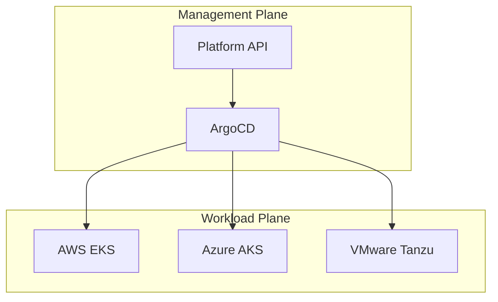

### 2. Hybrid Connectivity Model
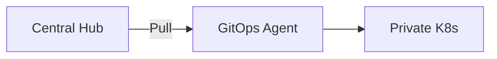

### 3. GitOps App Lifecycle (ArgoCD)
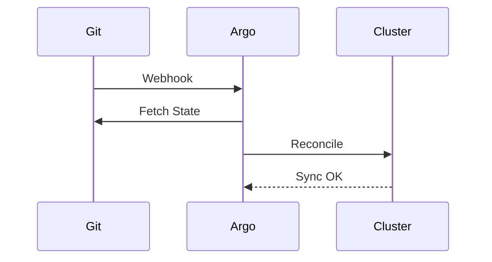

### 4. Cluster Onboarding Workflow
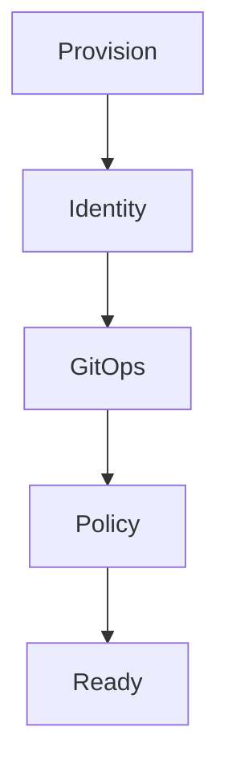

### 5. Multi-Cluster Service Mesh (Istio)
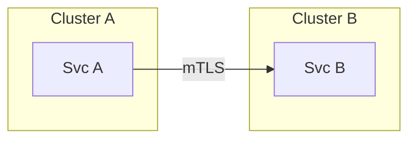

### 6. Namespace Self-Service Flow
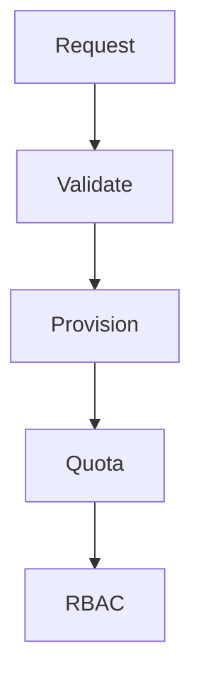

### 7. Zero-Trust Network Policy
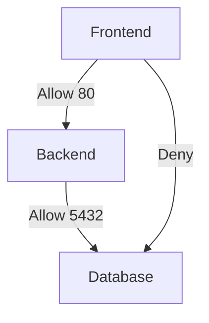

### 8. Backup & DR Topology
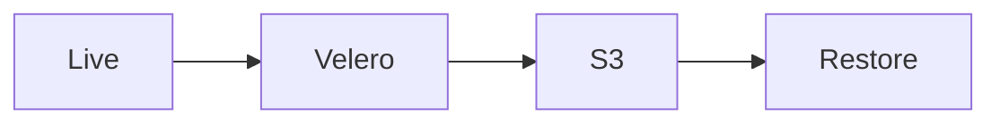

### 9. Blue/Green Cluster Upgrade
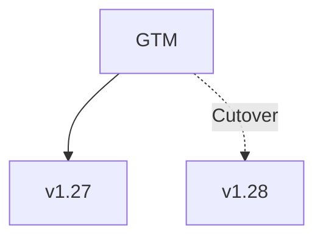

### 10. Cost Governance Pipeline
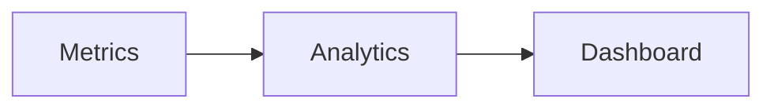

### 11. Pod Autoscaling (HPA/VPA)
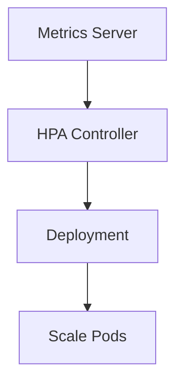

### 12. Node Autoscaling (Karpenter/CAS)
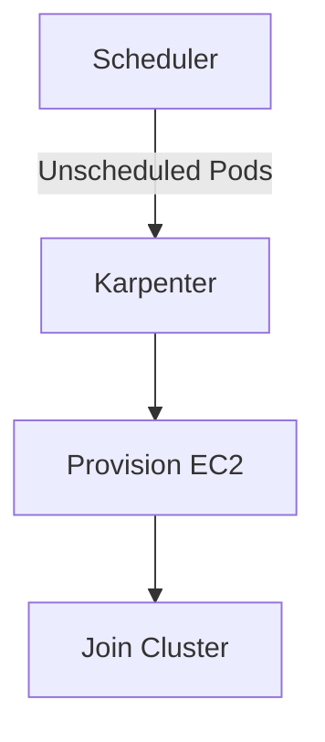

### 13. Image Scanning Pipeline
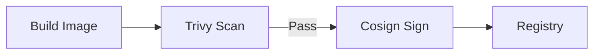

### 14. Admission Controller (Kyverno)
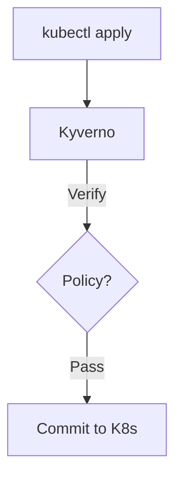

### 15. External DNS Sync
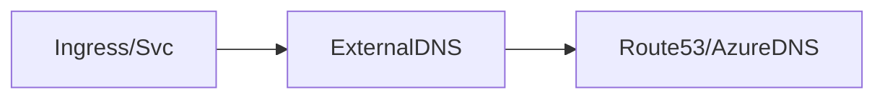

### 16. Secret Management (Vault CSI)
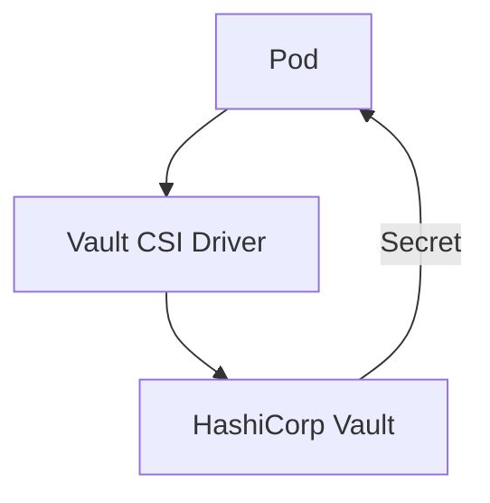

### 17. Multi-Tenant Isolation
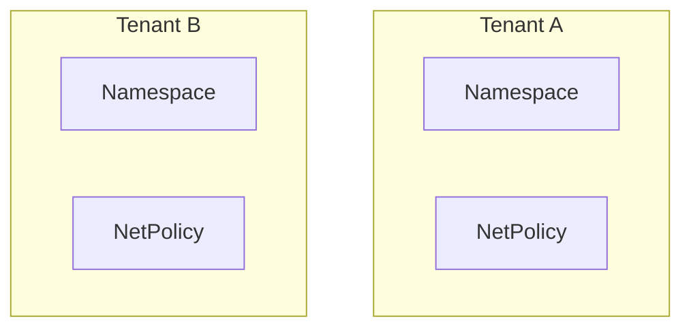

### 18. Cluster API (CAPI) Architecture
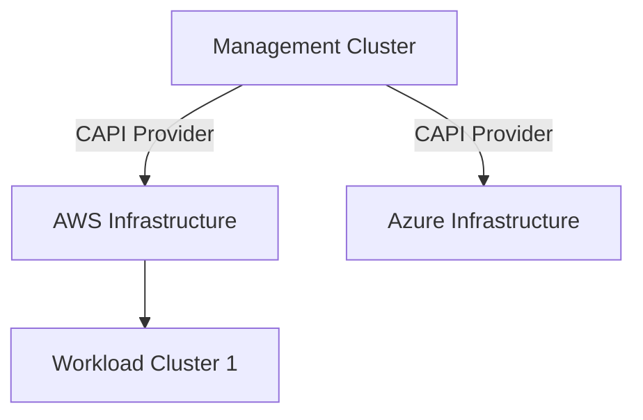

### 19. Prometheus Operator Flow
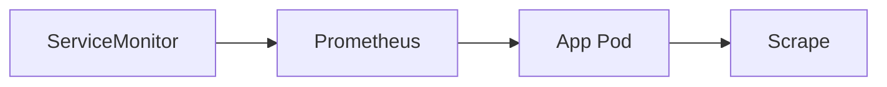

### 20. Ingress Controller (Nginx)
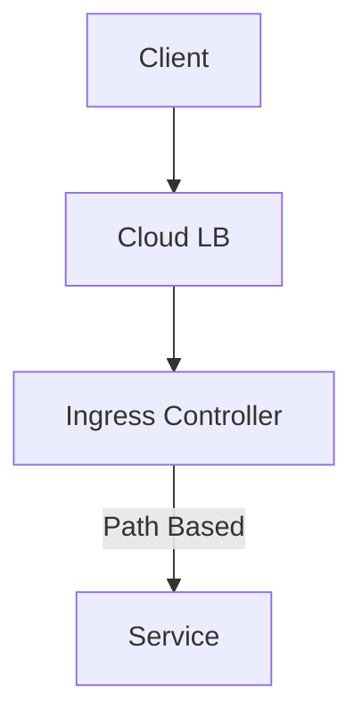

### 21. Log Aggregation (FluentBit)
```mermaid
graph LR
    Pod --> FB[FluentBit Agent]
    FB --> ES[ElasticSearch/Loki]
    ES --> K[Kibana/Grafana]
```

### 22. Sidecar Injection Pattern
```mermaid
graph TD
    Deploy[Deployment] --> Hook[Admission Hook]
    Hook --> Sidecar[Inject Proxy/Agent]
    Sidecar --> Pod[Running Pod]
```

### 23. Cluster Health Dashboard (Goldilocks)
```mermaid
graph LR
    Metrics[VPA Metrics] --> Gold[Goldilocks]
    Gold --> Recs[Resource Recommendations]
```

### 24. GitOps Drift Detection
```mermaid
stateDiagram-v2
    Sync --> OutOfSync: Cluster Change
    OutOfSync --> Reconcile: ArgoCD Auto-Sync
    Reconcile --> Sync: State Matched
```

### 25. Pod Security Standards (PSS)
```mermaid
graph TD
    NS[Namespace Label] --> PSS[PSS Controller]
    PSS -->|Restricted| Pod[Enforce SecurityContext]
```

### 26. Multi-Cluster Ingress (MCI)
```mermaid
graph TD
    GTM[Global Traffic Mgr] --> R1[Region A Cluster]
    GTM --> R2[Region B Cluster]
```

### 27. Crossplane Infrastructure (XRM)
```mermaid
graph LR
    K8s[K8s Resource] --> XP[Crossplane]
    XP --> RDS[AWS RDS Instance]
```

### 28. OIDC Auth Flow (K8s)
```mermaid
sequenceDiagram
    User->>IDP: Login
    IDP-->>User: ID Token
    User->>APIServer: kubectl (Token)
    APIServer->>IDP: Verify
```

### 29. Helm Chart Registry Flow
```mermaid
graph LR
    Chart[Helm Chart] --> Push[OCI Registry]
    Push --> Flux[Flux/ArgoCD]
    Flux --> Deploy[K8s Cluster]
```

### 30. Cluster Federation (Karmada)
```mermaid
graph TD
    Control[Karmada Control] -->|Resource Binding| C1[Member Cluster 1]
    Control -->|Resource Binding| C2[Member Cluster 2]
```

---
... (rest of the file remains same)
