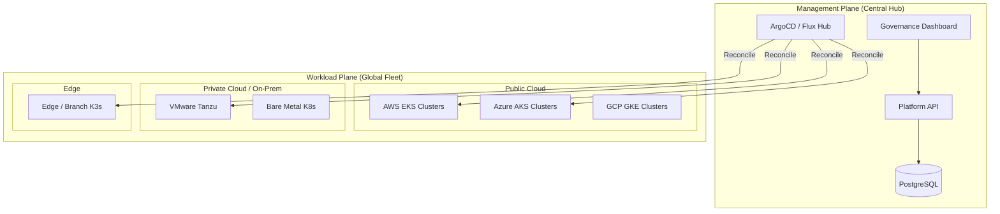
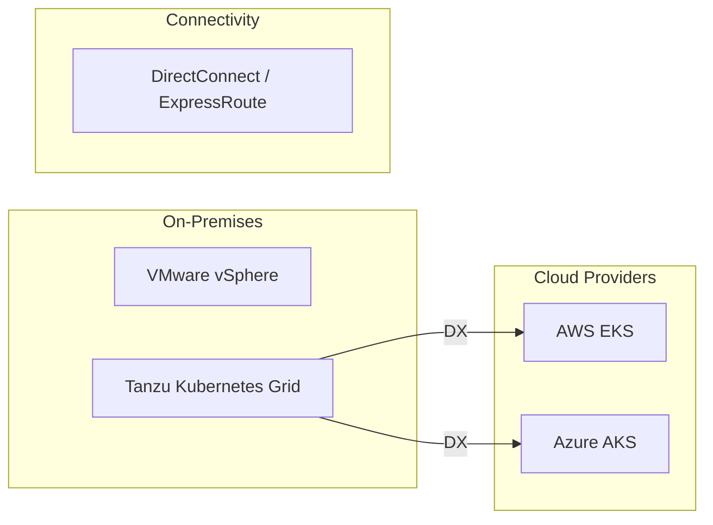
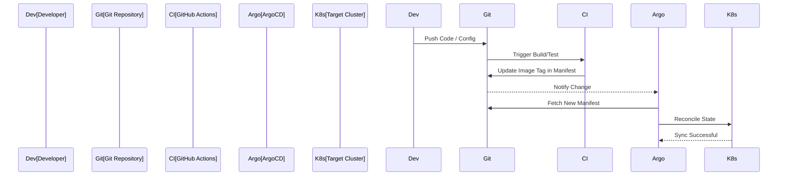

# ☸️ Hybrid Kubernetes Platform Patterns

[](https://kubernetes.io/)
[](https://www.terraform.io/)
[](https://argoproj.github.io/cd/)
[](https://opensource.org/licenses/MIT)

> **The definitive enterprise-grade repository for hybrid Kubernetes architecture, platform engineering patterns, and multi-cloud fleet governance.**

---

## 🏛️ Executive Summary

In the age of distributed computing, Kubernetes has become the standard operating system for the cloud. However, managing Kubernetes at enterprise scale across fragmented infrastructure—on-premises datacenters, VMware environments, edge sites, and multiple public clouds—presents massive operational and security challenges.

**Hybrid Kubernetes Platform Patterns** is a flagship initiative designed to provide a unified framework for running Kubernetes consistently everywhere. It centralizes cluster lifecycle management, policy enforcement, observability, and workload portability into a single platform engineering model.

### 🎯 Why Hybrid Kubernetes Matters

1.  **Workload Portability**: Deploy applications to any cluster (EKS, AKS, GKE, Tanzu) using the same GitOps workflow.
2.  **Unified Governance**: Enforce RBAC, Network Policies, and Quotas centrally across the entire fleet.
3.  **Cost Optimization**: Gain visibility into cluster spending and automate resource rightsizing (FinOps).
4.  **Operational Consistency**: Standardize on "Golden Paths" for developers to reduce cognitive load and improve speed to market.

---

## 🏗️ Architecture Overview

The platform uses a "Management Plane" vs "Workload Plane" architecture to separate global governance from regional execution.

### 1. Executive Architecture
*The high-level relationship between the Management Plane and the Global Fleet.*



### 2. Hybrid Kubernetes Topology
*Connecting diverse infrastructure under a single management umbrella.*



---

## 🚀 Platform Capabilities

### 🎡 Cluster Fleet Management
- **Centralized Inventory**: Real-time visibility into every cluster's health, version, and capacity.
- **Automated Provisioning**: Terraform-based blueprints for EKS, AKS, GKE, and Tanzu.
- **Upgrade Orchestration**: Managed rolling upgrades for clusters across regions.

### 🔄 GitOps Operations
- **ArgoCD / Flux Integration**: Declarative application management with automated synchronization.
- **Golden Path Templates**: Pre-configured Helm charts and Kustomize overlays for common app stacks.
- **Promotion Workflow**: Smooth transitions from Dev -> Staging -> Production across clusters.

### 🛡️ Security & Zero Trust
- **Unified RBAC**: Synchronize OIDC identities with Kubernetes RBAC across all distributions.
- **Policy as Code**: Kyverno / OPA Gatekeeper integration for real-time compliance enforcement.
- **Secrets Management**: Centralized Vault integration for secure secret injection.

---

## 📊 Platform Engineering Operating Model

The platform is designed to empower "Self-Service" for developers while maintaining "Guardrails" for the organization.

### 11. GitOps Flow (Developer Experience)


---

## 🛠️ Deployment Guide

### Prerequisites
- Docker & Docker Compose
- Node.js 18+
- Python 3.11+
- Terraform 1.4+
- `kubectl` & `helm`

### Local Setup
1.  **Clone the repository**:
    ```bash
    git clone https://github.com/devopstrio/hybrid-kubernetes-pattern.git
    cd hybrid-kubernetes-pattern
    ```
2.  **Start Platform Services**:
    ```bash
    make up
    ```
3.  **Access Dashboard**:
    Open `http://localhost:3000`

---

## 📋 Roadmap

- [ ] **Q3 2026**: Multi-cluster Service Mesh (Istio) reference implementation.
- [ ] **Q4 2026**: AI-driven node autoscaling (Karpenter) optimization.
- [ ] **Q1 2027**: Sovereign Cloud / Air-gapped cluster deployment patterns.

---

## 📜 License
Distributed under the MIT License. See `LICENSE` for more information.
