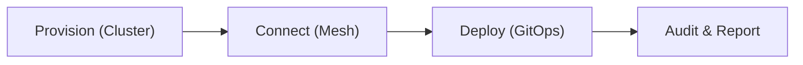
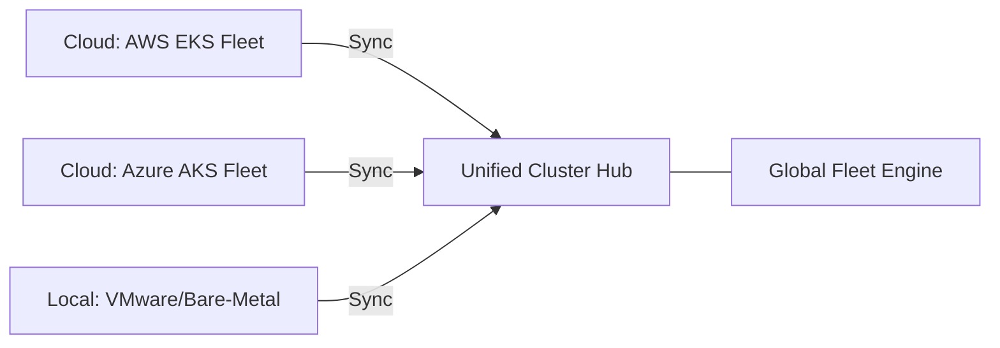
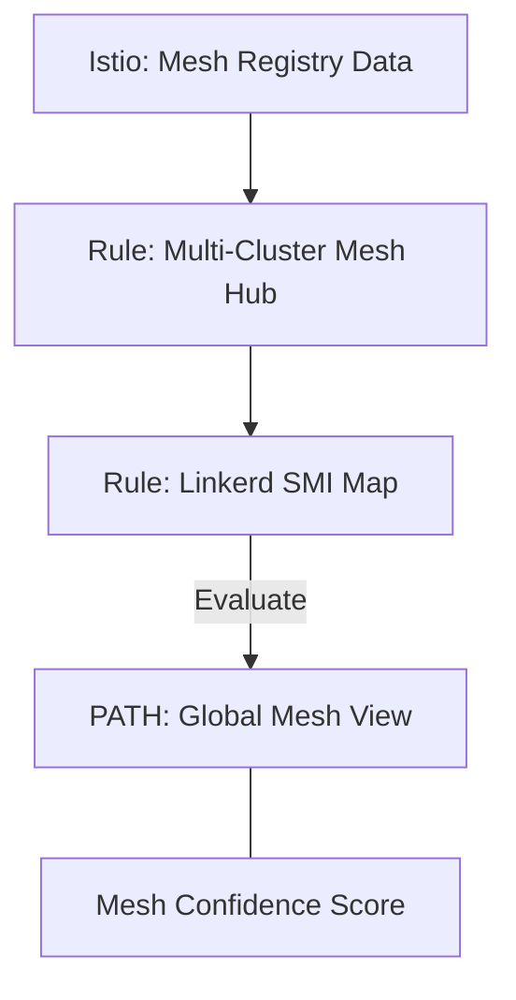
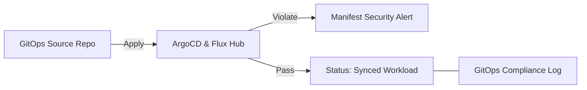
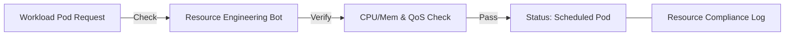
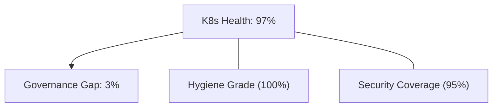
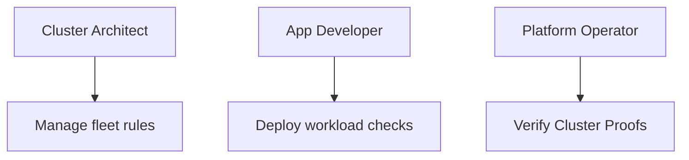
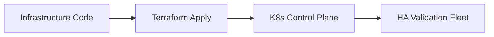
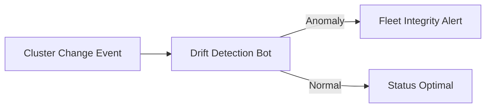
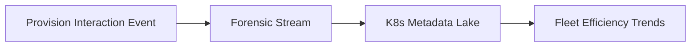

<div align="center">


<h1>Hybrid Kubernetes Pattern</h1>

<p><strong>The Institutional-Grade Platform for Multi-Cloud Cluster Orchestration, Hybrid Service Mesh, and GitOps-Driven Fleet Management.</strong></p>

[]()
[]()
[]()

<br/>

> **"Infrastructure is code; platform is a service."** 
> **Hybrid Kubernetes Pattern** is an enterprise-grade platform designed to provide a secure, measurable, and highly automated foundation for global container operations. It orchestrates the complex lifecycle of Kubernetes—from multi-cloud cluster provisioning and cross-cluster service mesh to GitOps-driven application delivery and unified cluster auditing.

</div>

---

## 🏛️ Executive Summary

Fragmented cluster management and manual application deployments are strategic operational liabilities; lack of centralized Kubernetes orchestration is a primary barrier to organizational cloud-native maturity. Organizations fail to maintain a secure container foundation not because of a lack of clusters, but because of fragmented pattern standards, lack of automated manifest validation, and an inability to orchestrate cluster landing zones with operational precision.

This platform provides the **Kubernetes Intelligence Plane**. It implements a complete **Enterprise Kubernetes-Pattern-as-Code Framework**, enabling Platform and SRE teams to manage global cluster fleets as first-class citizens. By automating the identification of resource bottlenecks through real-time telemetry analysis and orchestrating the deployment of secure cross-cluster service meshes, we ensure that every organizational workload—from core datacenter services to distributed edge pods—is orchestrated by default, audited for history, and strictly aligned with institutional Kubernetes frameworks.

---

## 📐 Architecture Storytelling: Principal Reference Models

### 1. Principal Architecture: Global Hybrid Kubernetes & Orchestration Intelligence Plane
This diagram illustrates the end-to-end flow from multi-cloud cluster provision and GitOps ingestion to cross-cluster service mesh, resource engineering, and institutional cluster auditing.


```mermaid
graph LR
    %% Subgraph Definitions
    subgraph ClusterIngress["Hybrid & Multi-Cloud Ingress"]
        direction TB
        Cloud_Clusters["EKS / AKS / GKE / On-Prem"]
        Workload_Telemetry["Pod & Node Metrics"]
        GitOps_Source["ArgoCD / Flux Manifests"]
    end

    subgraph IntelligenceEngine["Orchestration Intelligence Hub"]
        direction TB
        API["FastAPI Orchestration Gateway"]
        FleetManager["Multi-Cluster Fleet Orch"]
        ResourceEng_Hub["Resource Quota & QoS Hub"]
        MeshOrch["Cross-Cluster Service Mesh Hub"]
    end

    subgraph OperationsPlane["Distributed Kubernetes Fleet"]
        direction TB
        ClusterAPI_Workers["CAPI Provisioning Fleet"]
        GitOps_Reconcilers["Managed App Delivery Agents"]
        ServiceMesh_Gateways["Istio / Linkerd Hybrid Proxies"]
    end

    subgraph OperationsHub["Institutional Cluster Hub"]
        direction TB
        Scorecard["K8s Maturity Scorecard"]
        Analytics["Fleet Health & Density Stats"]
        Audit["Forensic K8s Metadata Lake"]
    end

    subgraph DevOps["Kubernetes-Pattern-as-Code Framework"]
        direction TB
        TF["Terraform Cluster Modules"]
        DriftBot["Manifest & Config Drift Validator"]
        ChatOps["Cluster Operations Hub"]
    end

    %% Flow Arrows
    ClusterIngress -->|1. Submit Cluster Request| API
    API -->|2. Orchestrate Fleet| FleetManager
    FleetManager -->|3. Apply Resource Policy| ResourceEng_Hub
    ResourceEng_Hub -->|4. Orchestrate Mesh| MeshOrch
    
    MeshOrch -->|5. Execute Provision| OperationsPlane
    OperationsPlane -->|6. Notify Status| ChatOps
    API -->|7. Visualize Health| Scorecard
    
    Scorecard -->|8. Track Maturity| Analytics
    Scorecard -->|9. Record Provision| Audit
    
    TF -->|10. Provision Backbone| IntelligenceEngine
    DriftBot -->|11. Inject Config Risk| FleetManager
    Audit -->|12. Improve Orchestration| ClusterAPI_Workers

    %% Styling
    classDef ingress fill:#f5f5f5,stroke:#616161,stroke-width:2px;
    classDef intel fill:#e8eaf6,stroke:#1a237e,stroke-width:2px;
    classDef operations fill:#e1f5fe,stroke:#01579b,stroke-width:2px;
    classDef ops fill:#ede7f6,stroke:#311b92,stroke-width:2px;
    classDef devops fill:#e8f5e9,stroke:#1b5e20,stroke-width:2px;

    class ClusterIngress ingress;
    class IntelligenceEngine intel;
    class OperationsPlane operations;
    class OperationsHub ops;
    class DevOps devops;
```

### 2. The Hybrid Kubernetes Lifecycle Flow
The continuous path of a hybrid Kubernetes pattern from initial provision (cluster) and connection (mesh) to active security policy, deployment (GitOps), and institutional forensic auditing.


```mermaid
graph LR
    Provision["Provision (Cluster)"] --> Connect["Connect (Mesh)"]
    Connect --> Deploy["Deploy (GitOps)"]
    Deploy --> Audit["Audit & Report"]
```

### 3. Distributed Hybrid Kubernetes Topology
Strategically orchestrating clusters across global environments (EKS, AKS, GKE, On-Prem, Edge), providing a unified institutional view of global container health and fleet readiness.


```mermaid
graph LR
    EKS["Cloud: AWS EKS Fleet"] -->|Sync| Hub["Unified Cluster Hub"]
    AKS["Cloud: Azure AKS Fleet"] -->|Sync| Hub
    OnPrem["Local: VMware/Bare-Metal"] -->|Sync| Hub
    Hub --- Logic["Global Fleet Engine"]
```

### 4. Cross-Cluster Service Mesh & Traffic Hub Flow
Executing complex logic for securing the bridge between Istio/Linkerd service meshes across hybrid boundaries, ensuring every organizational service is connected and verified against institutional standards.


```mermaid
graph TD
    Istio["Istio: Mesh Registry Data"] --> Bridge["Rule: Multi-Cluster Mesh Hub"]
    Bridge --> Linkerd["Rule: Linkerd SMI Map"]
    Linkerd -->|Evaluate| Context["PATH: Global Mesh View"]
    Context --- Estimate["Mesh Confidence Score"]
```

### 5. Secure GitOps & Continuous Delivery Flow
Automatically managing the lifecycle of applications across multi-cluster environments using ArgoCD/Flux, ensuring institutional deployment and security boundaries by default.


```mermaid
graph LR
    Repo["GitOps Source Repo"] -->|Apply| Guard["ArgoCD & Flux Hub"]
    Guard -->|Violate| Alert["Manifest Security Alert"]
    Guard -->|Pass| Verify["Status: Synced Workload"]
    Verify --- Audit["GitOps Compliance Log"]
```

### 6. Kubernetes Data Plane & Resource Engineering Flow
Managing the lifecycle of a pod request, automatically enforcing institutional resource quotas and performance guarantees for critical workloads, ensuring zero-latency operational confidence.


```mermaid
graph LR
    Pod["Workload Pod Request"] -->|Check| Gatekeeper["Resource Engineering Bot"]
    Gatekeeper -->|Verify| Quota["CPU/Mem & QoS Check"]
    Quota -->|Pass| Admit["Status: Scheduled Pod"]
    Admit --- Audit["Resource Compliance Log"]
```

### 7. Institutional Kubernetes Maturity Scorecard
Grading organizational performance based on key indicators: Cluster Hygiene Grade, Security Coverage, and Resource Efficiency Index.


```mermaid
graph TD
    Post["K8s Health: 97%"] --> Risk["Governance Gap: 3%"]
    Post --- C1["Hygiene Grade (100%)"]
    Post --- C2["Security Coverage (95%)"]
```

### 8. Identity & RBAC for Kubernetes Governance
Managing fine-grained access to orchestration hubs, provisioning workers, and audit logs between Cluster Architects, App Developers, and Platform Operators.


```mermaid
graph TD
    Architect["Cluster Architect"] --> Hub["Manage fleet rules"]
    Developer["App Developer"] --> Exec["Deploy workload checks"]
    Operator["Platform Operator"] --> Audit["Verify Cluster Proofs"]
```

### 9. IaC Deployment: Kubernetes-Pattern-as-Code Framework
Using modular Terraform to deploy and manage the versioned distribution of the orchestration tracking hubs, fleet management workers, and forensic metadata lakes.


```mermaid
graph LR
    HCL["Infrastructure Code"] --> TF["Terraform Apply"]
    TF --> Engine["K8s Control Plane"]
    Engine --> Clusters["HA Validation Fleet"]
```

### 10. AIOps Cluster Drift & Risk Validation Flow
Using advanced analytics to identify sudden surges in resource consumption, OOMKills, suspicious configuration drifts, or unusual pod pattern changes that could result in institutional risk.


```mermaid
graph LR
    Drift["Cluster Change Event"] --> Analyzer["Drift Detection Bot"]
    Analyzer -->|Anomaly| Alert["Fleet Integrity Alert"]
    Analyzer -->|Normal| Pass["Status Optimal"]
```

### 11. Metadata Lake for Forensic Kubernetes Audit
Storing long-term records of every cluster provisioned, every manifest change recorded, and every pod execution event for institutional record-keeping, compliance auditing, and post-provisioning forensics.


```mermaid
graph LR
    Provision["Provision Interaction Event"] --> Stream["Forensic Stream"]
    Stream --> Lake["K8s Metadata Lake"]
    Lake --> Trends["Fleet Efficiency Trends"]
```

---

## 🏛️ Core Governance Pillars

1.  **Unified Fleet Coordination**: Maximizing resilience by centralizing all cluster measurement through a single institutional plane.
2.  **Automated Cluster Provisioning**: Eliminating "manual cluster" scenarios through proactive orchestration and pattern verification.
3.  **Sequential Resource Intelligence**: Ensuring zero-interruption operations through dependency-aware multi-cluster resource engineering.
4.  **Zero-Trust Mesh Protection**: Automatically enforcing identity-based access and rule evaluation across all mesh tiers.
5.  **Autonomous Operations Logic**: Guaranteeing reliability through automated industry-specific cluster monitoring runbooks.
6.  **Full Cluster Auditability**: Immutable recording of every manifest change and cluster provision for institutional forensics.

---

## 🛠️ Technical Stack & Implementation

### Orchestration Engine & APIs
*   **Framework**: Python 3.11+ / FastAPI.
*   **Fleet Engine**: Custom Python-based logic for multi-cloud Cluster-API (CAPI) provisioning and DORA-style cluster metrics.
*   **Integrations**: Native connectors for AWS EKS, Azure AKS, Google GKE, and VMware Tanzu APIs.
*   **Persistence**: PostgreSQL (Fleet Ledger) and Redis (Live Fleet State).
*   **Auth Orchestrator**: Federated OIDC/SAML for least-privilege cluster management access.

### Governance Dashboard (UI)
*   **Framework**: React 18 / Vite.
*   **Theme**: Dark, Blue, Indigo (Modern high-fidelity container aesthetic).
*   **Visualization**: D3.js for cluster topologies and Recharts for fleet density analytics.

### Infrastructure & DevOps
*   **Runtime**: AWS EKS or Azure Kubernetes Service (AKS) for management plane.
*   **Fleet Hub**: Managed event sourcing for immutable cluster security timeline reconstruction.
*   **IaC**: Modular Terraform for deploying the cluster landing zone and validation fleet.

---

## 🏗️ IaC Mapping (Module Structure)

| Module | Purpose | Real Services |
| :--- | :--- | :--- |
| **`infrastructure/fleet_hub`** | Central management plane | EKS, PostgreSQL, Redis |
| **`infrastructure/clusters`** | Distributed cluster provisioners | Cluster-API (CAPI), Cloud APIs |
| **`infrastructure/gitops`** | Multi-Cluster Manifest Hubs | ArgoCD, Flux, Webhooks |
| **`infrastructure/auditing`** | Forensic cluster sinks | S3, Athena, Quicksight |

---

## 🚀 Deployment Guide

### Local Principal Environment
```bash
# Clone the pattern platform
git clone https://github.com/devopstrio/hybrid-kubernetes-pattern.git
cd hybrid-kubernetes-pattern

# Configure environment
cp .env.example .env

# Launch the Hybrid K8s stack
make init

# Trigger a mock cluster provisioning and automated manifest validation simulation
make simulate-fleet
```

Access the Management Portal at `http://localhost:3000`.

---

## 📜 License
Distributed under the MIT License. See `LICENSE` for more information.

---
<div align="center">
  <p>© 2026 Devopstrio. All rights reserved.</p>
</div>
