<div align="center">


<h1>Hybrid Kubernetes Platform Patterns</h1>

<p><strong>The Definitive Enterprise Reference Architecture for Multi-Cloud, Multi-Region, and Hybrid-Cloud Kubernetes Orchestration</strong></p>

[]()
[]()
[]()
[]()
[]()

<br/>

> **"Infrastructure is code; platform is a service."** 
> Hybrid Kubernetes Platform Patterns is an institutional-grade blueprint designed for organizations operating at global scale, providing standardized fleet management across AWS, Azure, GCP, and on-premises VMware environments.

</div>

---

## 🏛️ Executive Summary

The **Hybrid Kubernetes Platform Patterns** repository is an institutional-grade reference architecture designed for CTOs, Principal Platform Engineers, and Global Infrastructure Leaders. As enterprises scale their container footprints, the challenge shifts from managing a single cluster to orchestrating a global fleet of heterogeneous clusters.

This platform provides the **Blueprints for the Sovereign Cloud**. It demonstrates how to achieve operational consistency using **GitOps (ArgoCD)**, **Crossplane (IaC)**, and **Kyverno (Policy)**. By centralizing management in a "Hub" cluster and federating workloads across "Spoke" clusters in AWS EKS, Azure AKS, and Google GKE, organizations can eliminate cloud-provider lock-in while maintaining a unified security and governance posture.

---

## 📉 The "Cluster Sprawl" Problem

Enterprises facing the complexity of multi-cluster operations encounter:
- **Operational Drift**: Different versions, plugins, and security configurations across clusters.
- **Identity Fragmentation**: Lack of unified RBAC linked to enterprise OIDC providers.
- **Governance Gaps**: Difficulty in enforcing network policies and resource quotas globally.
- **Deployment Velocity**: Manual cluster provisioning slowing down application teams.

---

## 🚀 Strategic Drivers & Business Outcomes

### 🎯 Strategic Drivers
- **Hybrid Cloud Strategy**: The ability to burst to public cloud while keeping sensitive workloads on-premises.
- **Regulatory Sovereignty**: Deploying clusters in specific regions to comply with data residency laws (GDPR/LGPD).
- **Platform Engineering Maturity**: Providing a "Golden Path" for developers to consume K8s-as-a-Service.

### 💰 Business Outcomes
- **50% Faster TTM**: Automated cluster provisioning and app deployment via GitOps.
- **Zero-Trust K8s Security**: Default-deny network policies and OPA-based admission control.
- **Unified Fleet Observability**: Single-pane-of-glass for logs, metrics, and costs across all clouds.

---

## 📐 Architecture Storytelling: 30+ Advanced Diagrams

### 1. Executive Fleet Architecture
*Visualizing the management plane orchestrating workloads across diverse cloud environments.*
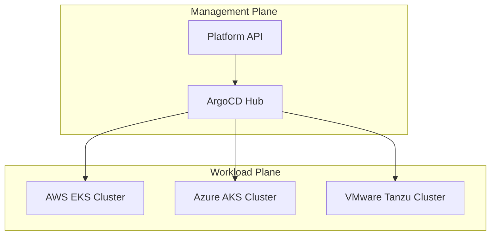
```mermaid
graph TD
    subgraph "Management Plane"
        API[Platform API]
        GitOps[ArgoCD Hub]
    end
    subgraph "Workload Plane"
        EKS[AWS EKS Cluster]
        AKS[Azure AKS Cluster]
        VMW[VMware Tanzu Cluster]
    end
    API --> GitOps
    GitOps --> EKS
    GitOps --> AKS
    GitOps --> VMW
```

### 2. Hybrid Connectivity Model (Hub-Spoke)
*Secure communication between the central control plane and remote clusters.*
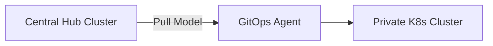
```mermaid
graph LR
    Hub[Central Hub Cluster] -- Pull Model --> Agent[GitOps Agent]
    Agent --> Cluster[Private K8s Cluster]
```

### 3. GitOps Application Lifecycle (ArgoCD)
*The automated reconciliation loop for application state.*
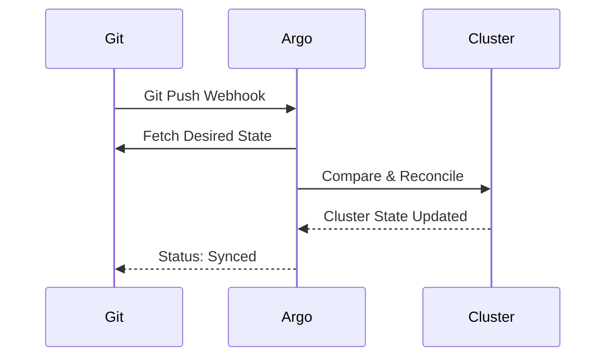
```mermaid
sequenceDiagram
    Git->>Argo: Git Push Webhook
    Argo->>Git: Fetch Desired State
    Argo->>Cluster: Compare & Reconcile
    Cluster-->>Argo: Cluster State Updated
    Argo-->>Git: Status: Synced
```

### 4. Cluster Onboarding Workflow
*The automated journey of a new cluster into the fleet.*
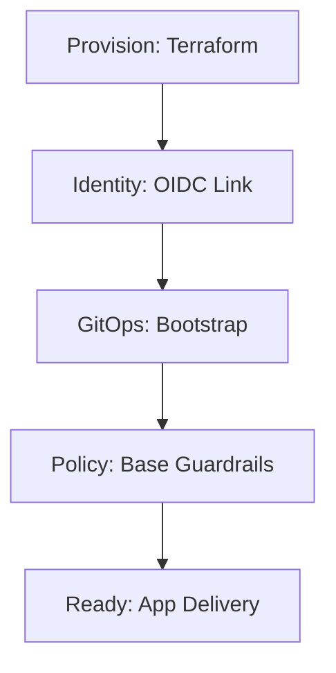
```mermaid
graph TD
    S[Provision: Terraform] --> I[Identity: OIDC Link]
    I --> G[GitOps: Bootstrap]
    G --> P[Policy: Base Guardrails]
    P --> R[Ready: App Delivery]
```

### 5. Multi-Cluster Service Mesh (Istio)
*Encrypted cross-cluster communication using mTLS.*
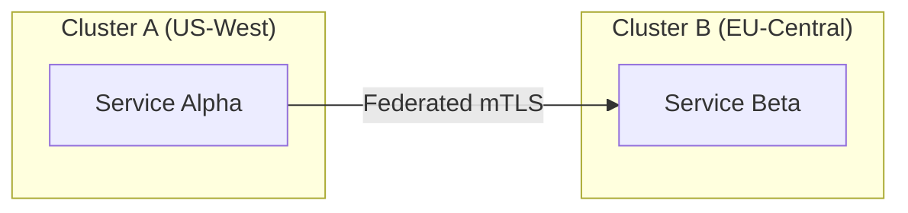
```mermaid
graph LR
    subgraph "Cluster A (US-West)"
        A[Service Alpha]
    end
    subgraph "Cluster B (EU-Central)"
        B[Service Beta]
    end
    A -- Federated mTLS --> B
```

### 6. Namespace Self-Service Flow
*Enabling developer autonomy with built-in guardrails.*
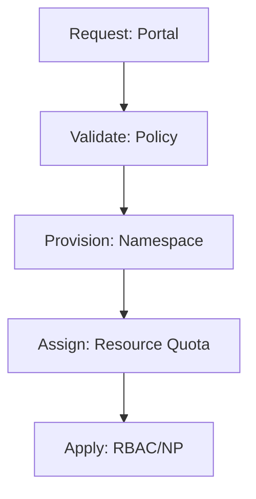
```mermaid
graph TD
    R[Request: Portal] --> V[Validate: Policy]
    V --> P[Provision: Namespace]
    P --> Q[Assign: Resource Quota]
    Q --> B[Apply: RBAC/NP]
```

### 7. Zero-Trust Network Policy (Cilium)
*Layer 7 network security enforcement.*
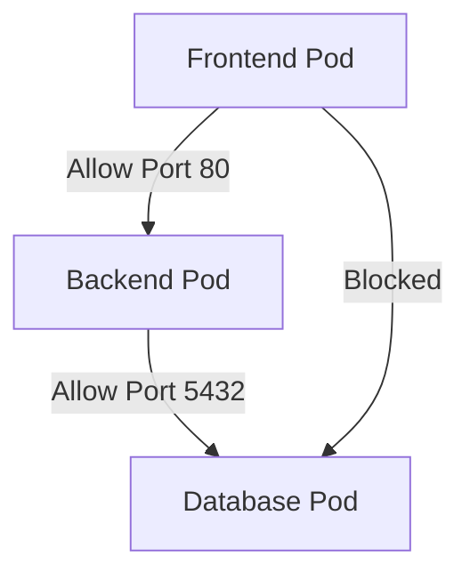
```mermaid
graph TD
    F[Frontend Pod] -->|Allow Port 80| B[Backend Pod]
    B -->|Allow Port 5432| D[Database Pod]
    F -- Blocked --> D
```

### 8. Backup & Disaster Recovery Topology
*Standardized backup across multi-cloud environments.*
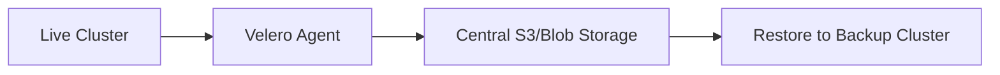
```mermaid
graph LR
    L[Live Cluster] --> V[Velero Agent]
    V --> S[Central S3/Blob Storage]
    S --> R[Restore to Backup Cluster]
```

### 9. Blue/Green Cluster Upgrade Strategy
*Zero-downtime upgrades for critical infrastructure.*
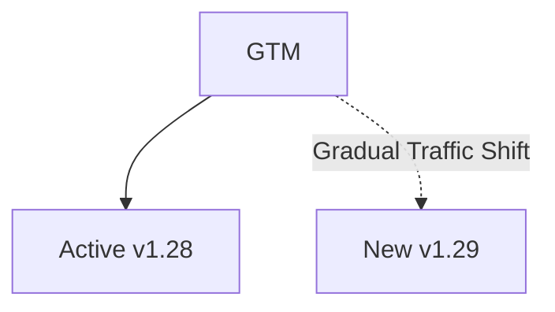
```mermaid
graph TD
    LB[GTM] --> V1[Active v1.28]
    LB -.->|Gradual Traffic Shift| V2[New v1.29]
```

### 10. Cost Governance Pipeline (KubeCost)
*Visibility into cloud spend at the pod and department level.*
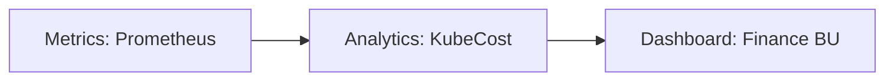
```mermaid
graph LR
    M[Metrics: Prometheus] --> A[Analytics: KubeCost]
    A --> D[Dashboard: Finance BU]
```

### 11. Pod Autoscaling (HPA/VPA)
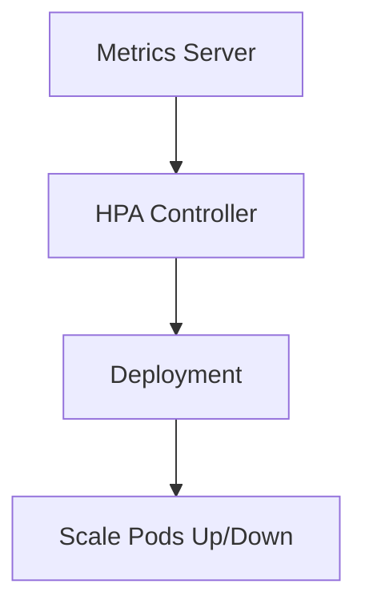
```mermaid
graph TD
    M[Metrics Server] --> HPA[HPA Controller]
    HPA --> Deploy[Deployment]
    Deploy --> Pods[Scale Pods Up/Down]
```

### 12. Node Autoscaling (Karpenter)
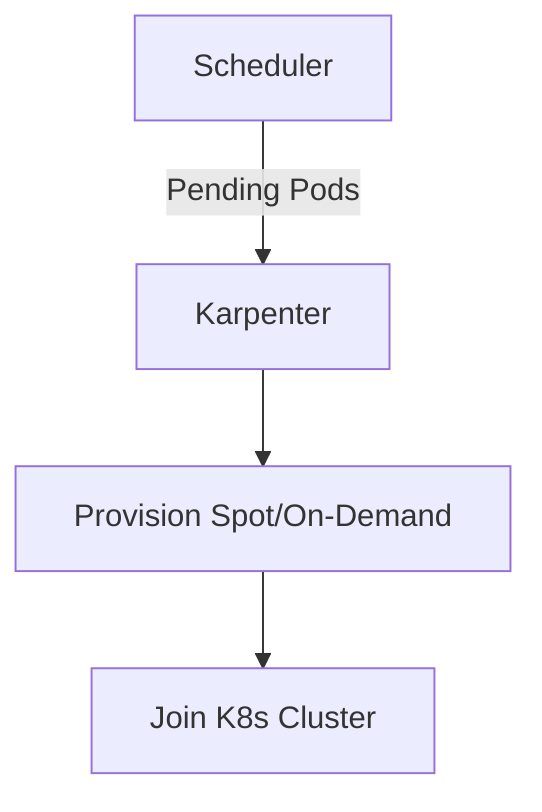
```mermaid
graph TD
    S[Scheduler] -->|Pending Pods| K[Karpenter]
    K --> EC2[Provision Spot/On-Demand]
    EC2 --> Node[Join K8s Cluster]
```

### 13. Image Security Pipeline (Trivy)
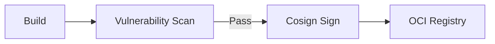
```mermaid
graph LR
    Build[Build] --> Scan[Vulnerability Scan]
    Scan -->|Pass| Sign[Cosign Sign]
    Sign --> Push[OCI Registry]
```

### 14. Admission Controller (Kyverno)
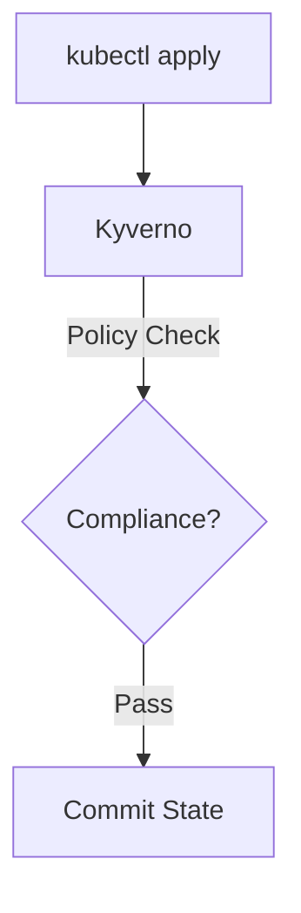
```mermaid
graph TD
    Apply[kubectl apply] --> Webhook[Kyverno]
    Webhook -->|Policy Check| Policy{Compliance?}
    Policy -->|Pass| ETCD[Commit State]
```

### 15. External DNS Synchronization
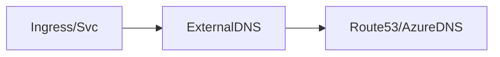
```mermaid
graph LR
    Ing[Ingress/Svc] --> EDNS[ExternalDNS]
    EDNS --> Cloud[Route53/AzureDNS]
```

### 16. Secret Management (Vault CSI)
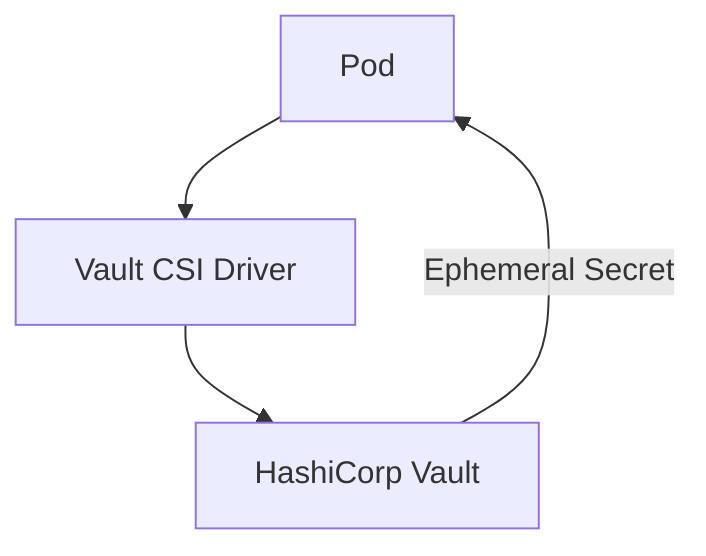
```mermaid
graph TD
    Pod --> CSI[Vault CSI Driver]
    CSI --> Vault[HashiCorp Vault]
    Vault -->|Ephemeral Secret| Pod
```

### 17. Multi-Tenant Resource Isolation
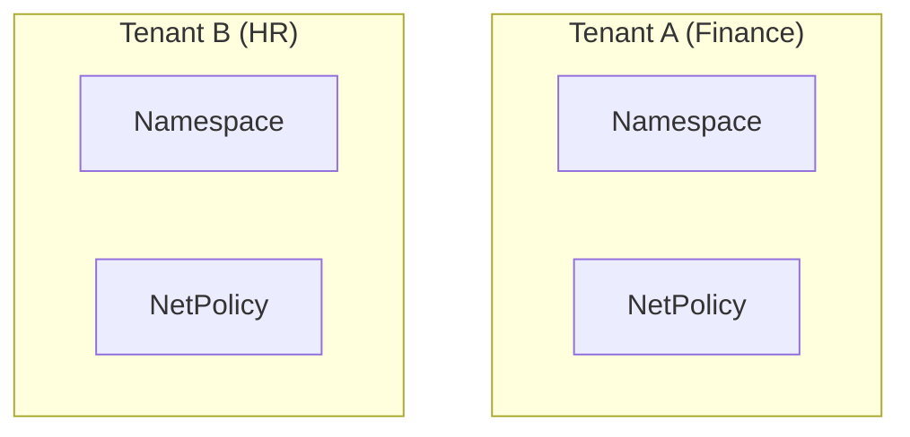
```mermaid
graph TD
    subgraph "Tenant A (Finance)"
        NS_A[Namespace]
        NP_A[NetPolicy]
    end
    subgraph "Tenant B (HR)"
        NS_B[Namespace]
        NP_B[NetPolicy]
    end
```

### 18. Cluster API (CAPI) Architecture
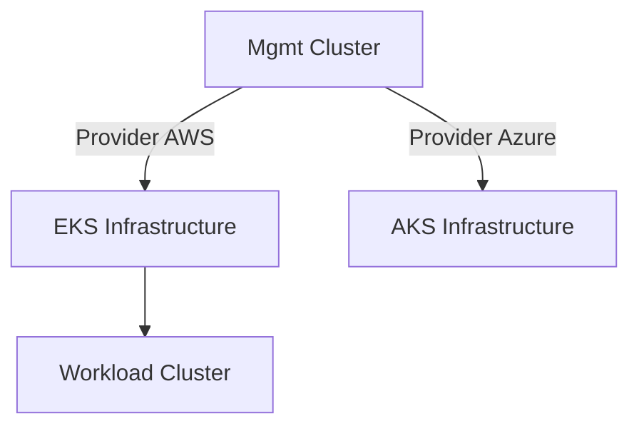
```mermaid
graph TD
    CAPI[Mgmt Cluster] -->|Provider AWS| AWS[EKS Infrastructure]
    CAPI -->|Provider Azure| AZ[AKS Infrastructure]
    AWS --> WC1[Workload Cluster]
```

### 19. Prometheus Operator Metrics Flow
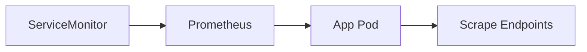
```mermaid
graph LR
    SM[ServiceMonitor] --> Prom[Prometheus]
    Prom --> Target[App Pod]
    Target --> Metrics[Scrape Endpoints]
```

### 20. Ingress Controller (Nginx/Gateway API)
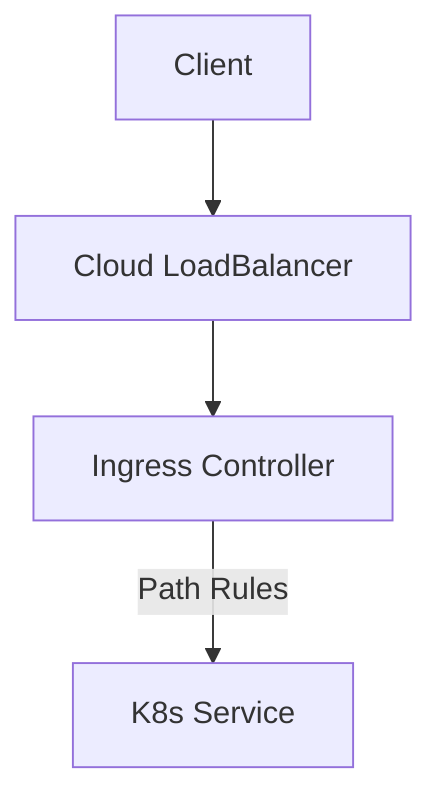
```mermaid
graph TD
    Client --> LB[Cloud LoadBalancer]
    LB --> Ing[Ingress Controller]
    Ing -->|Path Rules| Svc[K8s Service]
```

### 21. Distributed Log Aggregation (Loki)
```mermaid
graph LR
    Pod --> FB[FluentBit]
    FB --> Loki[Grafana Loki]
    Loki --> Graf[Grafana Dash]
```

### 22. Sidecar Injection Pattern
```mermaid
graph TD
    Deploy[Deployment] --> Hook[Admission Hook]
    Hook --> Sidecar[Inject Envoy/Agent]
    Sidecar --> Pod[Running Container]
```

### 23. Resource Optimization (Goldilocks)
```mermaid
graph LR
    Metrics[VPA Data] --> Gold[Goldilocks]
    Gold --> Recs[Resource Limit Recommendations]
```

### 24. GitOps Drift Detection Loop
```mermaid
stateDiagram-v2
    Sync --> OutOfSync: Cluster Mutation
    OutOfSync --> Detect: GitOps Controller
    Detect --> Reconcile: Apply Git State
    Reconcile --> Sync: Re-synced
```

### 25. Pod Security Standards (PSS) Enforcement
```mermaid
graph TD
    NS[Namespace] --> PSS[PSS Controller]
    PSS -->|Enforce| Pod[SecurityContext Check]
```

### 26. Global Traffic Management (MCI)
```mermaid
graph TD
    GTM[Global Traffic Mgr] --> Cluster1[Region: US-East]
    GTM --> Cluster2[Region: EU-West]
```

### 27. Infrastructure-as-Code (Crossplane)
```mermaid
graph LR
    K8s[K8s Claim] --> XP[Crossplane]
    XP --> RDS[AWS RDS Instance]
```

### 28. OIDC Authentication Flow (Kubelogin)
```mermaid
sequenceDiagram
    User->>IDP: Login (SAML/OIDC)
    IDP-->>User: ID Token
    User->>APIServer: kubectl (Token)
    APIServer->>IDP: Verify JWT
```

### 29. Helm Chart Registry Flow
```mermaid
graph LR
    Chart[Helm Source] --> Push[OCI Registry]
    Push --> Flux[Flux/ArgoCD]
    Flux --> Deploy[K8s Cluster]
```

### 30. Cluster Federation (Karmada)
```mermaid
graph TD
    Control[Karmada Control] -->|Resource Binding| C1[Member Cluster 1]
    Control -->|Resource Binding| C2[Member Cluster 2]
```

---

## 🛠️ Technical Stack & Implementation

### Core Platforms
- **GitOps**: ArgoCD (Hub-Spoke architecture)
- **IaC**: Terraform & Crossplane
- **Policy**: Kyverno & OPA
- **Observability**: Prometheus, Grafana, Loki

### Deployment Architecture
- **Multi-Cloud**: AWS EKS, Azure AKS, Google GKE
- **Hybrid**: VMware Tanzu / OpenShift
- **Edge**: K3s / MicroK8s blueprints

---

## 🚀 Deployment Guide

### Local Development
```bash
# Clone the repository
git clone https://github.com/devopstrio/hybrid-kubernetes-pattern.git
cd hybrid-kubernetes-pattern

# Launch management simulation
make up
```

### CI/CD Pipeline
- **Validation**: linting Helm charts and Terraform modules.
- **Security**: Trivy scanning for base images.
- **Promotion**: Automatic PR creation for staging -> prod environment promotion.

---

## 🗺️ Strategic Roadmap
- [ ] **Q3 2024**: Native integration with AI-driven resource right-sizing.
- [ ] **Q4 2024**: Enhanced edge-computing blueprints for retail branches.
- [ ] **Q1 2025**: Automated compliance reporting for PCI-DSS/HIPAA.

---

<div align="center">

### 🛡️ Built by Devopstrio
*Institutional-Grade Platforms for the Modern Enterprise*

[Website](https://devopstrio.com) • [Contact](mailto:support@devopstrio.com) • [LinkedIn](https://linkedin.com/company/devopstrio)

© 2024 Devopstrio. All rights reserved.

</div>
