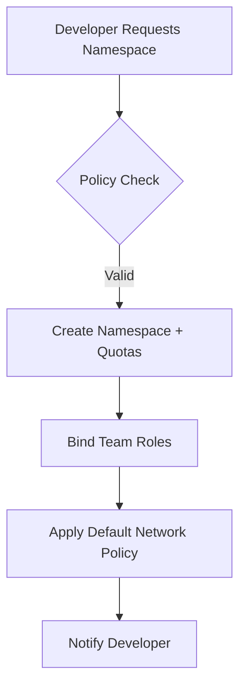
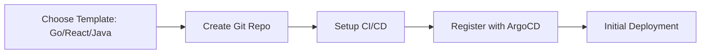
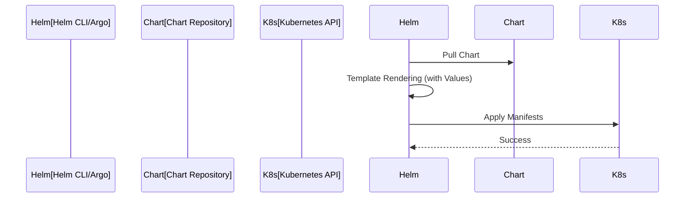
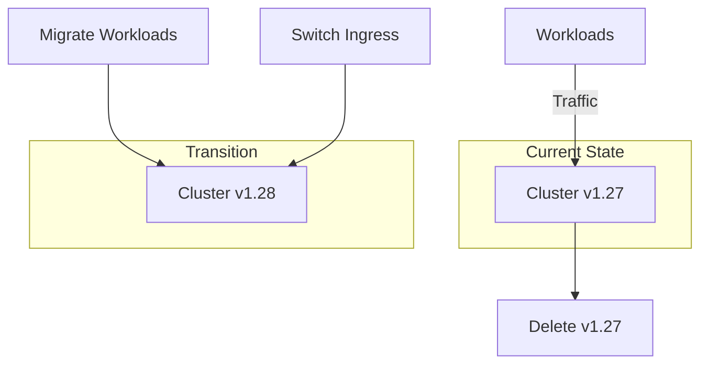

# Platform Engineering Diagrams

## 14. Namespace Lifecycle
*The self-service process for a developer to request and receive a namespace.*

## 15. Golden Path Workflow

## 16. Helm Release Flow

## 19. Cluster Upgrades (Blue/Green)

