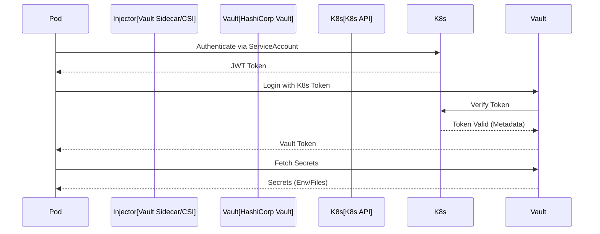
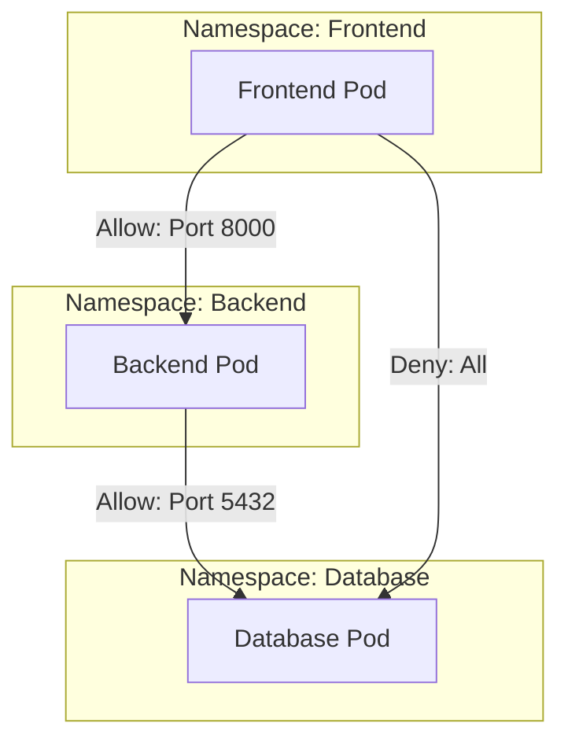
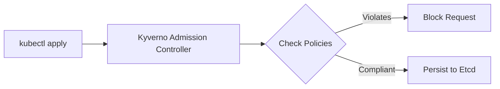

# Kubernetes Security Diagrams

## 24. Vault Integration Flow
*How secrets are injected into pods from HashiCorp Vault.*

```mermaid
sequenceDiagram
    participant Pod
    participant Injector[Vault Sidecar/CSI]
    participant Vault[HashiCorp Vault]
    participant K8s[K8s API]

    Pod->>K8s: Authenticate via ServiceAccount
    K8s-->>Pod: JWT Token
    Pod->>Vault: Login with K8s Token
    Vault->>K8s: Verify Token
    K8s-->>Vault: Token Valid (Metadata)
    Vault-->>Pod: Vault Token
    Pod->>Vault: Fetch Secrets
    Vault-->>Pod: Secrets (Env/Files)
```

## 25. Network Policy Model

```mermaid
graph TD
    subgraph "Namespace: Frontend"
        FE[Frontend Pod]
    end
    subgraph "Namespace: Backend"
        BE[Backend Pod]
    end
    subgraph "Namespace: Database"
        DB[Database Pod]
    end

    FE -- "Allow: Port 8000" --> BE
    BE -- "Allow: Port 5432" --> DB
    FE -- "Deny: All" --> DB
```

## 26. Policy as Code Flow (Kyverno)

```mermaid
graph LR
    User[kubectl apply] --> Webhook[Kyverno Admission Controller]
    Webhook --> Validate{Check Policies}
    Validate -- "Violates" --> Deny[Block Request]
    Validate -- "Compliant" --> Allow[Persist to Etcd]
```
